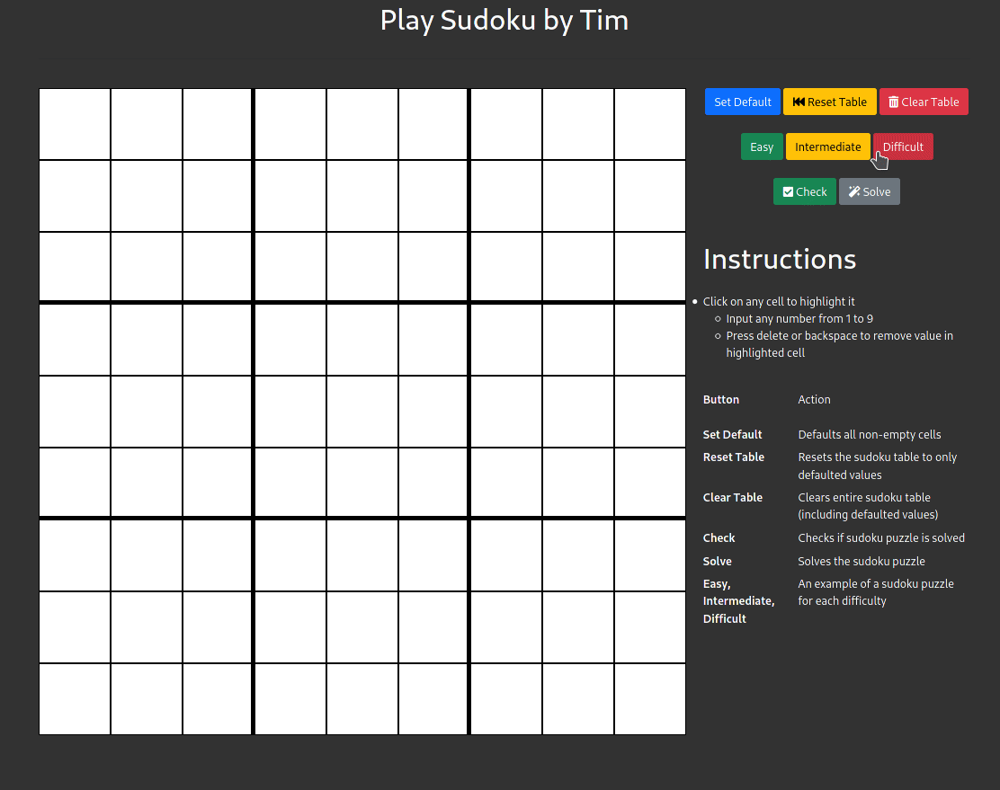

# Play Sudoku by Tim
Author: Timothy Pham

## Overview
### Description
The website is hosted on GitHub Pages: https://tpham2580.github.io/playSudoku/

### Website Walkthough GIF

### Instructions
1. Click on any cell to highlight it
2. Input any number from 1 to 9 or press delete or backspace to remove value in highlighted cell

Button | Action 
| :--- | :---
Set Default  | Defaults all non-empty cells
Reset Table  | Resets the sudoku table to only defaulted values
Clear Table  | Clears entire sudoku table (including defaulted values)
Easy, Intermediate, Difficult  | An example of a sudoku puzzle for each difficulty
Check  | Checks if sudoku puzzle is solved
Solve  | Solves the sudoku puzzle

## 🔨 Play Sudoku is built with
  - [Bootstrap](https://getbootstrap.com/)
